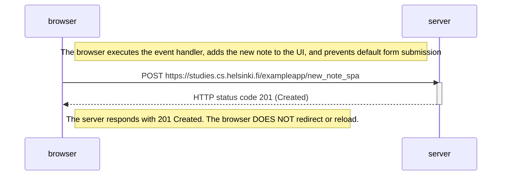

```mermaid
sequenceDiagram
    participant browser
    participant server

    Note right of browser: The browser executes the event handler, adds the new note to the UI, and prevents default form submission

    browser->>server: POST https://studies.cs.helsinki.fi/exampleapp/new_note_spa
    activate server
    server-->>browser: HTTP status code 201 (Created)
    deactivate server

    Note right of browser: The server responds with 201 Created. The browser DOES NOT redirect or reload.
```